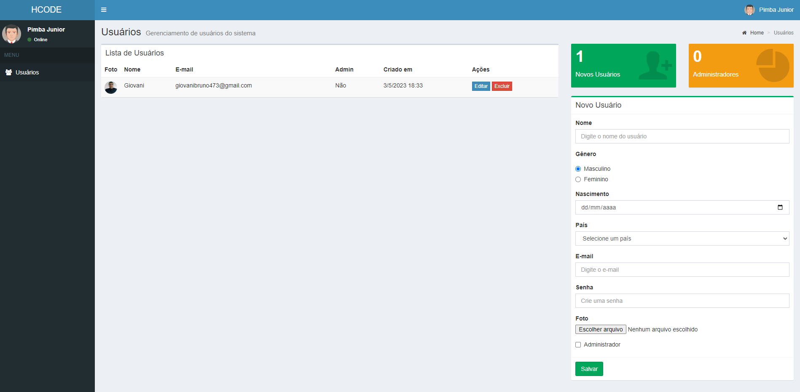

# Projeto-Gerenciamento-de-usuarios-Parte-1

## Descrição do Projeto: Gerenciamento de usuarios
Esse projeto consiste em criar um site usando JavaScript para armazenar dados de usuários, como nome, email, senha, nacionalidade, etc. A primeira parte envolve a validação e edição do site, usando recursos como localStorage. 

## Tecnologias usadas
- JavaScript: para o gerenciamento e armazenamento dos dados.

## Como Usar
- Faça o download do zip e extraia em sua maquina
- Abra o aplicativo em um navegador da web
- Adicione, remova ou edite os usuários

## Autor
- Eu :), com ajuda de um curso oferecido por hcode
- O conteúdo visual, html, css, além de algumas configurações foi fornecido pelo curso da Hcode, o código foi desenvolvido em conjunto com as aulas desse curso.

obs: No futuro, será adicionada a parte do backend para aprimorar ainda mais o projeto.

